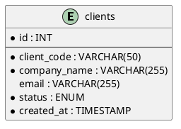

# Entity Relationship Diagram

## Overview

This document describes the entity relationships in the lumanitech_erp_clients database.

## Current Schema (v1.0)

### Entities

```
┌─────────────────────────────────────┐
│        schema_migrations            │
├─────────────────────────────────────┤
│ • version (PK)                      │
│ • description                       │
│ • applied_at                        │
└─────────────────────────────────────┘


┌─────────────────────────────────────┐
│           clients                   │
├─────────────────────────────────────┤
│ • id (PK)                           │
│ • client_code (UNIQUE)              │
│ • company_name                      │
│ • legal_name                        │
│ • email                             │
│ • phone                             │
│ • website                           │
│ • address_line1                     │
│ • address_line2                     │
│ • city                              │
│ • state_province                    │
│ • postal_code                       │
│ • country                           │
│ • tax_id                            │
│ • industry                          │
│ • client_type                       │
│ • status                            │
│ • credit_limit                      │
│ • payment_terms                     │
│ • created_at                        │
│ • updated_at                        │
│ • created_by                        │
│ • updated_by                        │
└─────────────────────────────────────┘


┌─────────────────────────────────────┐
│       active_clients (VIEW)         │
├─────────────────────────────────────┤
│ Filtered view of clients            │
│ WHERE status = 'active'             │
└─────────────────────────────────────┘
```

### Relationships

Currently, the schema has no foreign key relationships. All tables are independent.

**Rationale:**
- Domain isolation (no cross-database relationships)
- Relationships managed at API layer
- Simpler database structure
- Easier to maintain and scale

## Future Enhancements

Potential future entities and relationships:

### Client Contacts

```
┌─────────────────────────────────────┐
│         client_contacts             │
├─────────────────────────────────────┤
│ • id (PK)                           │
│ • client_id (FK → clients.id)       │
│ • contact_name                      │
│ • contact_email                     │
│ • contact_phone                     │
│ • contact_role                      │
│ • is_primary                        │
│ • created_at                        │
│ • updated_at                        │
└─────────────────────────────────────┘
              │
              │ many-to-one
              ▼
         clients
```

### Client Addresses

```
┌─────────────────────────────────────┐
│       client_addresses              │
├─────────────────────────────────────┤
│ • id (PK)                           │
│ • client_id (FK → clients.id)       │
│ • address_type                      │
│ • address_line1                     │
│ • address_line2                     │
│ • city                              │
│ • state_province                    │
│ • postal_code                       │
│ • country                           │
│ • is_primary                        │
│ • created_at                        │
│ • updated_at                        │
└─────────────────────────────────────┘
              │
              │ many-to-one
              ▼
         clients
```

### Client Notes

```
┌─────────────────────────────────────┐
│         client_notes                │
├─────────────────────────────────────┤
│ • id (PK)                           │
│ • client_id (FK → clients.id)       │
│ • note_text                         │
│ • note_type                         │
│ • created_at                        │
│ • created_by                        │
└─────────────────────────────────────┘
              │
              │ many-to-one
              ▼
         clients
```

## Cardinality

### Current

No relationships exist.

### Planned

- clients : client_contacts = 1 : N (one-to-many)
- clients : client_addresses = 1 : N (one-to-many)
- clients : client_notes = 1 : N (one-to-many)

## Indexes for Relationships

When relationships are implemented, appropriate foreign key indexes will be created:

```sql
-- client_contacts
CREATE INDEX idx_client_contacts_client_id ON client_contacts(client_id);

-- client_addresses
CREATE INDEX idx_client_addresses_client_id ON client_addresses(client_id);

-- client_notes
CREATE INDEX idx_client_notes_client_id ON client_notes(client_id);
```

## Referential Integrity

When foreign keys are implemented:

- CASCADE on UPDATE (update child records when parent ID changes)
- RESTRICT on DELETE (prevent deletion of parent if children exist)
- Or use soft delete pattern (status = 'archived')

## Cross-Database Relationships

**Not Allowed.**

This database is isolated from other ERP modules.  
Inter-module data access is via API calls only.

```
┌────────────────────────┐
│  lumanitech_erp_       │
│  clients (this DB)     │
└────────────────────────┘
           ↕ API
┌────────────────────────┐
│  lumanitech_erp_       │
│  projects              │
└────────────────────────┘
           ↕ API
┌────────────────────────┐
│  lumanitech_erp_       │
│  procurement           │
└────────────────────────┘
```

## Diagram Tools

To generate visual ERD diagrams:

### Using MySQL Workbench

1. Connect to database
2. Database → Reverse Engineer
3. Select lumanitech_erp_clients
4. Generate diagram

### Using dbdiagram.io

```dbml
Table clients {
  id int [pk, increment]
  client_code varchar(50) [unique, not null]
  company_name varchar(255) [not null]
  email varchar(255)
  status enum [not null, default: 'active']
  created_at timestamp [not null, default: `now()`]
}

Table schema_migrations {
  version varchar(50) [pk]
  description varchar(255) [not null]
  applied_at timestamp [not null, default: `now()`]
}
```

### Using PlantUML



## See Also

- [schema.md](schema.md) - Detailed schema documentation
- [DATA_DICTIONARY.md](DATA_DICTIONARY.md) - Data dictionary
- [DATABASE_DESIGN.md](DATABASE_DESIGN.md) - Design principles
